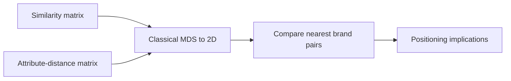
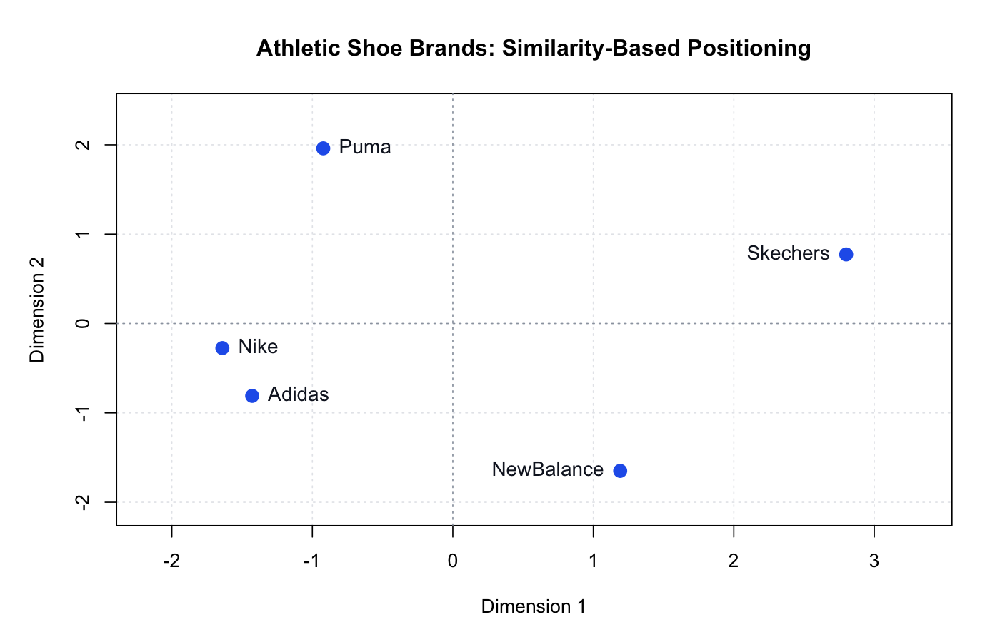
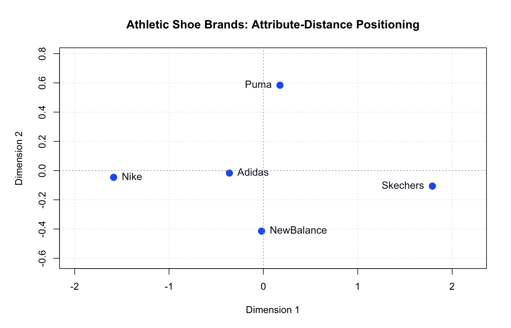

# Athletic Footwear Competitive Positioning

How consumers position Nike, Adidas, New Balance, Skechers, and Puma is analyzed through two different lenses: overall similarity and attribute-derived distance.

This project was completed with Bhavisha Chafekar, Omkar Thombare, Parul Chaudhary, and Shivanshu Dagur. This public repository contains Saloni Jain's reproducible analysis layer and aggregate pairwise distances only; it does not include respondent-level data, survey submissions, or course materials.

## Business question

How does the competitive picture change when consumers rely on holistic brand impressions versus more structured product attributes?

## Approach



1. Validate two five-brand distance matrices.
2. Reconstruct each matrix as a two-dimensional perceptual map using classical multidimensional scaling.
3. Compare the nearest brand pairs and the proportion of positive-eigenvalue fit retained in two dimensions.
4. Translate the geometry into positioning implications without treating axis direction as inherently meaningful.

## Findings

- **Nike and Adidas** were the nearest pair in the holistic similarity data.
- **Adidas and New Balance** had the smallest distance in the attribute-derived matrix, showing that structured ratings can produce a different competitive neighborhood.
- The similarity map placed Nike and Adidas in a clear mainstream athletic cluster while New Balance, Skechers, and Puma were more differentiated.
- The team's attribute interpretation described the competitive space through **Design–Comfort** and **Premium–Budget** trade-offs.
- The two-dimensional solution retained **78.37%** of fit for holistic similarity and **95.56%** for attribute-derived distances.
- The open budget/design space suggested a potential positioning hypothesis for further consumer validation.

## Outputs

### Similarity-based positioning



### Attribute-distance positioning



## Run

```bash
Rscript R/analyze_positioning.R
Rscript tests/test_analysis.R
```

The analysis writes map coordinates, summary metrics, and both PNG visualizations to `outputs/`.

## Interpretation boundary

Perceptual-map orientation and sign are arbitrary. The maps support relative-distance interpretation, not causal claims about why a brand occupies a particular position. Aggregate distances are retained here for reproducibility; individual survey responses remain excluded.
